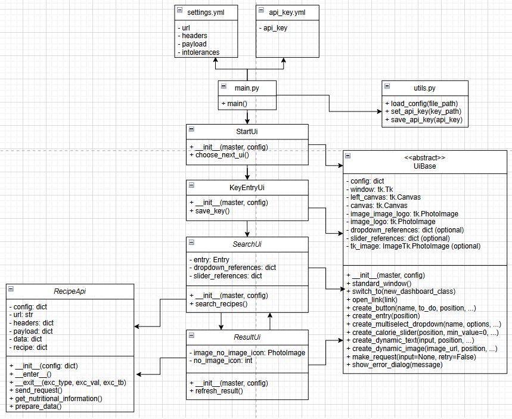
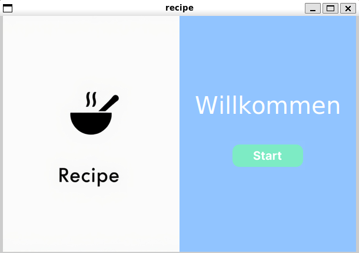
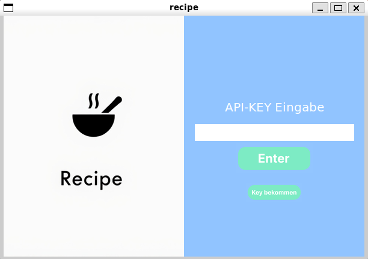
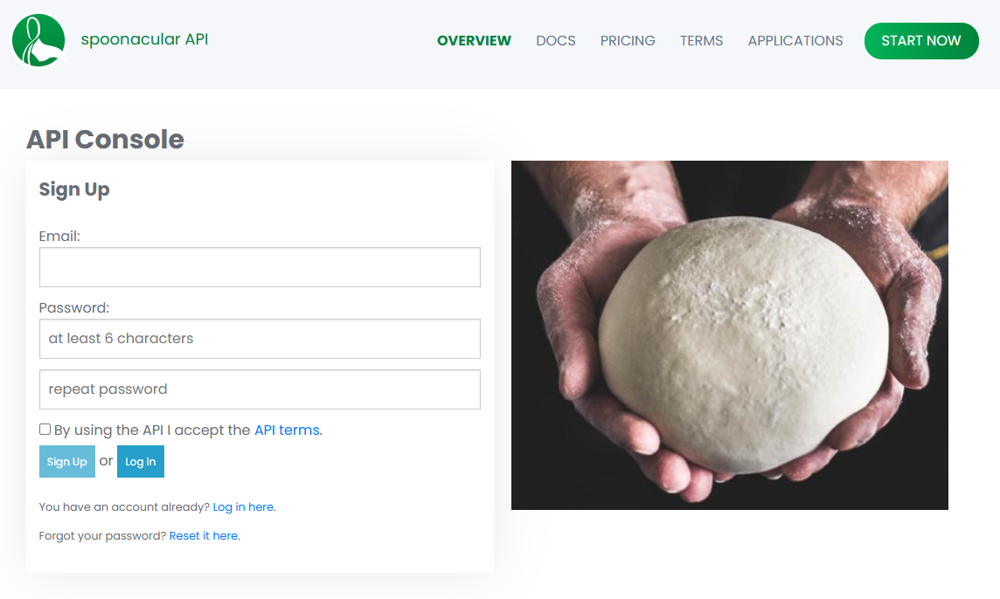
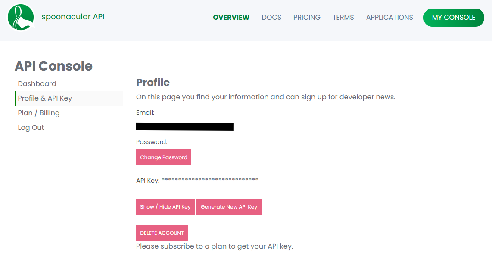
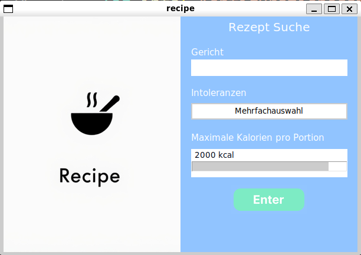
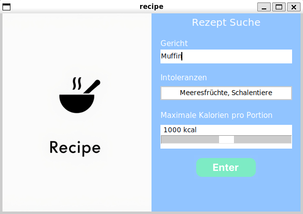
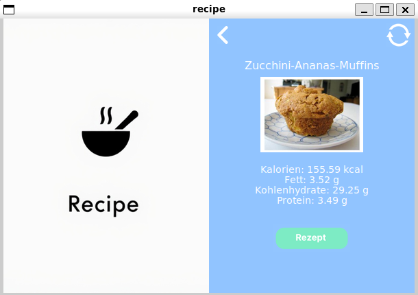
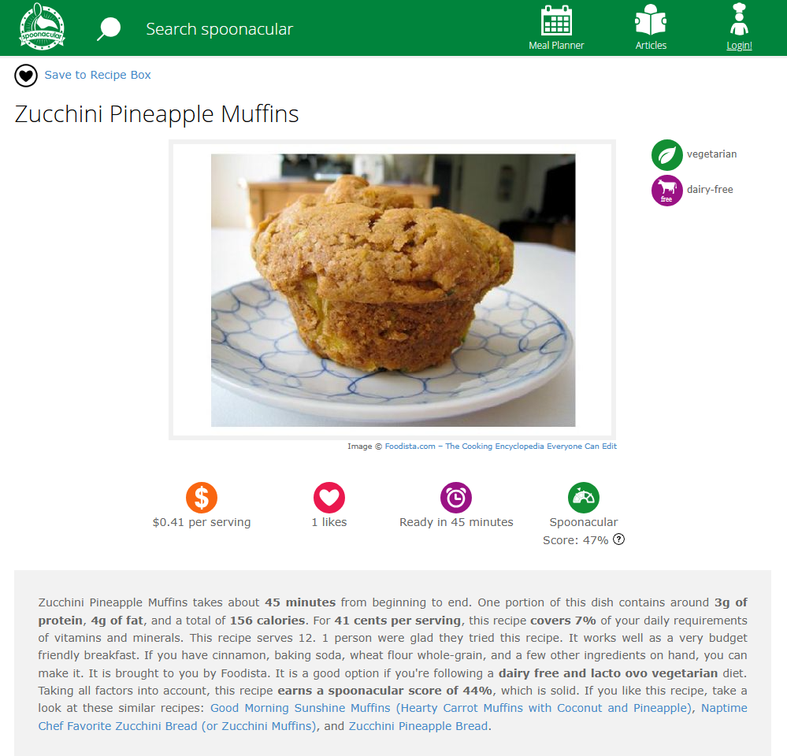

Projektpräsentation Rezept-Empfehlungs-Anwendung
  

DLBSEPPSD01_D - Projekt: Software Development
  

Aufgabenstellung 3 -  Entwicklung einer sonstigen Anwendung
  

**Voraussetzungen:**  
- Python 3.x
- Standardbrowser hinterlegt (für open_link funktion)
- ggf. make  

**Einrichtung mit make:**  
 - make prepare in der Konsole ausführen  
   
**Einrichtung ohne make:**  
 - virtuelle Python Umgebung erzeugen:  
    python3 -m venv venv  
 - virtuelle Umgebung aktivieren:  
    Windows -> venv\Scripts\activate  
    Linux/Mac -> source venv/bin/activate  
 - Abhängigkeiten aus der requirements.txt installieren:  
    pip install -r requirements.txt  
  
**Aufbau des Projektes:**  

  

**Nutzung des Projektes:**  
1. Ausführen der main.py  

  

2. Über den Start Button zur Key_Entry Seite gelangen (nur beim ersten mal)

  

  

3. Mit dem Key Bekommen Button zur Login Seite der Spoonacular API gelangen  

  

4. Account erstellen und zur Profile Seite navigieren  

  

5. Angezeigten Api Key in die Key_Entry Seite einfügen und zur Search Seite gelangen  

  

 

6. Individuelle Parameter auf der Search Seite angeben  

  

 

7. Über Enter Button das Ergebnis anzeigen lassen 

  

  

8. Über Rezept Button zum Rezept kommen  

  

8. Nächste Anfrage über den zurück oder reload Button der recipe Seite ausführen  

**Zusatzinfos:**  
 - Der Reload Button zeigt immer das nächst passendste Ergebnis zur vorherigen Anfrage an
 - Die Närhwert-Angaben sind pro Portion
 - Eingaben können auf deutsch erfolgen (wird für die Api übersetzt)
 - Die Ergebnisseite kann ebenfalls über den Browser übersetzt werden